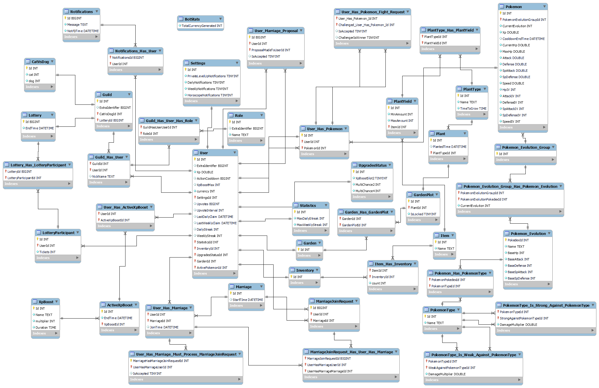

# TTT-Bot-Backend

# Database
For the ttt-bot backend a MySQL database is used. The database was created with MySQL Workbench. The sql script found in the database folder was generated using the forward engineering feature from MySQL Workbench.

### EER Diagram
